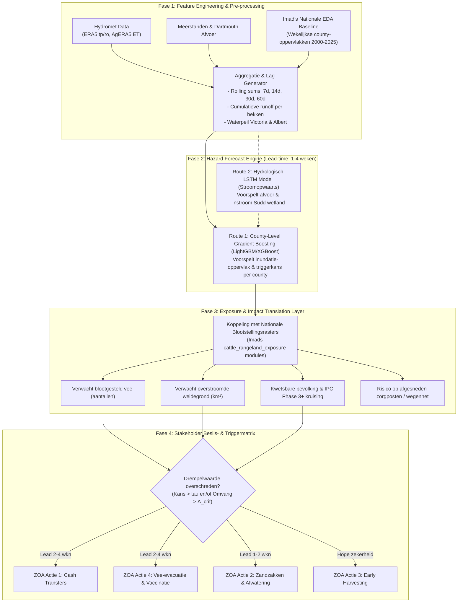

# Machine Learning Architectuur & Strategisch Voorstel: Nationaal Niveau Zuid-Soedan

**Project:** Capstone Data Challenge – Zero Hunger Lab (Tilburg University / TU/e) & ZOA International  
**Auteur:** Imad (voortbouwend op de Nationale Flood & Exposure EDA)  
**Datum:** Maandag Presentatie / Discussiedocument voor het team  
**Doel:** Architectuurvoorstel en routekaart voor het modelleren van overstromingsdynamiek en impact-based anticipatory action op nationaal niveau.

---

## 1. Context & Doelstelling: Van Data naar Anticipatory Action

### 1.1 De Vraag van de Stakeholders (ZOA & Zero Hunger Lab)
Humanitaire organisaties reageren traditioneel pas nádat een ramp heeft plaatsgevonden. Het doel van ZOA International en het Zero Hunger Lab is een structurele transitie naar **Anticipatory Action (AA)**: gerichte humanitaire interventies plegen in het kritieke tijdvenster *tussen* het moment van betrouwbare voorspelling en de daadwerkelijke overstroming.

Concreet moet onze modellering antwoord geven op vier kernvragen van de beleidsmakers:
1. **Waar en wanneer treedt overstroming op?** (Spatio-temporele hazard-voorspelling met een *lead time* van 1 tot 4 weken).
2. **Wat is de verwachte omvang en ernst?** (Inundatie-oppervlak in $\text{km}^2$ op Admin-2/countyniveau).
3. **Wat is de verwachte impact op levensonderhoud en voedselzekerheid?** (Blootstelling van veestapels, weidegrond, landbouwgewassen en bevolking; interactie met IPC Phase 3+ hongersnoodniveaus).
4. **Wanneer en waar moet een actietrigger afgaan?** (Welke drempelwaarde en welk betrouwbaarheidsniveau rechtvaardigen het vrijgeven van budget voor specifieke acties?).

### 1.2 Interventievensters van ZOA
| Interventie | Karakteristiek & Doel | Vereiste Lead Time | Risico van Valse Alarmen (Type I Fout) |
|---|---|---|---|
| **1. Cash Transfers** | Meest flexibel; stelt huishoudens in staat voedsel op te slaan of vee te verplaatsen | **2 – 4 weken** | Matig (kosten van vroegtijdige uitbetaling, maar budget bereikt doelgroep) |
| **2. Tijdelijke Waterkeringen** | Zandzakken, greppels graven, dijken verstevigen | **1 – 2 weken** | Laag (arbeid en materialen blijven lokaal nuttig) |
| **3. Vroegtijdig Oogsten (Early Harvest)** | Gewassen oogsten vóór inundatie | **1 – 3 weken** | **Extreem hoog** (vroegtijdig oogsten leidt tot gegarandeerd opbrengstverlies; vereist zeer hoge voorspelzekerheid) |
| **4. Vee-evacuatie & Vaccinatie** | Voorkomen van veesterfte door verdrinking en infectieziekten (miltvuur, Rift Valley) | **2 – 4 weken** | Matig (logistiek intensief voor pastorale gemeenschappen) |

---

## 2. Wat is er al gedaan? De Nationale Grondslag (Imads EDA)

Voorafgaand aan het modelleren hebben we de analyse succesvol opgeschaald van de 5 counties in Northern Bahr el Ghazal (Aweil) naar **het volledige nationale niveau**:

1. **Schaalgrootte & Data Pipeline:**
   - Analyse van alle **79 counties** over alle **10 staten** van Zuid-Soedan.
   - MODIS-satelliettegels `h20v08` en `h21v08` voor 2000–2025 verwerkt (**104 Parquet-bestanden**, meer dan **58 miljoen positieve detecties**).
   - Wekelijkse unie-aggregaties berekend voor **40.904 county-weken** met overstromingsdetecties.
   - Identificatie van **8.476 opeenvolgende detectiereeksen (runs)**, waarbij moeras- en wetlandregio's tot wel 279 weken aaneengesloten detecties vertonen.

2. **Geometrische & Methodologische Correcties:**
   - Correcte sferische rasteroppervlakteberekening ($R = 6.371.007,181\text{ m}$ volgens NASA MCDWD specificatie: $\sim 0,0530\text{ km}^2$ per cel i.p.v. de foutieve vaste $0,0625\text{ km}^2$).
   - Ontdubbeling van overlappende 3-daagse satellietcomposieten binnen kalenderweken (maandag t/m zondag).
   - Oplossen van overlap tussen de klassen `recurring` en `unusual` (geen dubbeltellingen van cellen die binnen één week van label wisselen).

3. **Nationale Blootstellingskoppeling (Exposure):**
   - **Vee (Cattle Raster, 9,3 km):** Proportionele cel-intersectie berekend; overstroomt 20% van een gridcel, dan wordt 20% van het vee als potentieel blootgesteld meegeteld (voorkomt overschatting).
   - **Weidegrond (ASAP Rangeland Raster, 250 m):** Percentagebegrazing per pixel geëxtraheerd en gesommeerd op countyniveau.
   - **Nationale Rangschikking & Seizoenspatronen:**
     - **Rubkona (Unity State)** voert nationaal de lijst aan met gemiddeld **$\sim 5.900$ blootgestelde runderen** en **$44,4\text{ km}^2$ weidegrond** per week in overstroomd gebied.
     - **Aweil East** staat nationaal op de 9e plaats voor veeblootstelling en 16e voor weidegrond.
     - Nationale piek in inundatie-oppervlak en weidegrond ligt in **januari** ($\sim 1.623\text{ km}^2$ en $\sim 698\text{ km}^2$/week nationaal); de veeblootstellingspiek ligt in **december** ($\sim 38.067$ runderen/week).

4. **Kritieke Databeperkingen & Randvoorwaarden:**
   - `cloud_frac` is in de ruwe MODIS-data continu 0; geen detectie betekent dus *geen bevestigd water*, maar bewijst niet dat het land droog was.
   - Statische rasters (vee en weidegrond) vangen de dynamische, seizoensgebonden transhumance (nomadische trek) niet volledig op.
   - Labels voor overstromingsrecurrence (`recurring` vs `unusual`) bevatten informatie over de gehele tijdreeks; direct gebruik als feature zou tot ernstige *data leakage* leiden in voorspelmodellen.

---

## 3. Beschikbare Databronnen: De Drie Pilaren

Onze data valt uiteen in drie categorieën met verschillende spatio-temporele resoluties:

```text
+---------------------------------------------------------------------------------------------------+
|                                      DATA-ARCHITECTUUR                                            |
+---------------------------------+---------------------------------+-------------------------------+
| 1. DRIVERS (Hydrometrie)        | 2. HAZARD TARGETS (Satelliet)   | 3. EXPOSURE & VULNERABILITY   |
+---------------------------------+---------------------------------+-------------------------------+
| - ERA5 Neerslag (tp) & Runoff   | - MODIS/VIIRS 250m Flood Masks  | - 79 County Grenzen (Admin-2) |
|   (dagelijks, continentaal grid)|   (2000-2025, tiles h20v08/h21) | - WorldPop Bevolking (90m)    |
| - AgERA5 Evapotranspiratie (ET) | - Wekelijkse Unie-Oppervlakken  | - GeoNode Veestapel (9.3km)   |
| - Dartmouth Rivierafvoer (m3/s) |   (km2 per county-week)         | - ASAP Rangeland & Cropland   |
|   (hydrologische stations)      | - Gedetecteerde Run-lengtes     | - IPC Voedselonzekerheid      |
| - Grote Meren Waterstanden      |   (opeenvolgende weken)         |   (Phase 3+ populaties)       |
|   (Victoria, Kyoga, Albert)     |                                 | - OSM Wegennet & Zorgposten   |
+---------------------------------+---------------------------------+-------------------------------+
```

---

## 4. Evaluatie van Mogelijke Machine Learning Modellen

Niet elk model is gemaakt voor dezelfde taak. We moeten voorkomen dat we zomaar modellen gaan draaien zonder dat de output matcht met de beslisvragen van ZOA:

| Modeltype | Doelvariabele (Target) | Input Features | Geschiktheid voor Stakeholder (ZOA/ZHL) | Voordelen | Nadelen & Risico's |
|---|---|---|---|---|---|
| **A. Binary Trigger Classification** (LightGBM, XGBoost, CatBoost) | Binary indicator: $Y_{c, t+k} \in \{0, 1\}$ (Overstroming overschrijdt risicodrempel in week $t+k$) | Geaggregeerde hydromet lags (1–8 wkn neerslag, runoff, rivierstanden, bodemvocht-proxy) | **Optimaal voor actietriggers** (directe aansluiting bij Cash Transfers en Dijkaanleg) | Hoge rekensnelheid; uitstekend met tabulaire data; direct interpreteerbaar (SHAP values); drempelwaarde ($\tau$) afstembaar op kosten van fout-positief vs fout-negatief | Geeft geen continue omvang in $\text{km}^2$; vereist een zorgvuldige definitie van de binaire drempel (bv. 80e percentiel inundatie) |
| **B. Continuous Inundation Regression** (Quantile LightGBM, Ridge, GAM) | Continu oppervlak: $A_{c, t+k}$ ($\text{km}^2$ overstroomd gebied per county) | Zelfde als A, plus autoregressieve lags van inundatie ($A_{c, t-1}, A_{c, t-2}$) | **Zeer waardevol voor schade-inschatting en budgetallocatie** | Geeft de verwachte omvang; met Quantile Regression ($p10, p50, p90$) krijgen stakeholders een betrouwbaarheidsinterval | Neerslag-inundatierelatie is sterk niet-lineair; overstromingen hebben veel nulwaarden (zero-inflated target) |
| **C. Hydrologische Sequence Models** (LSTM, GRU, Temporal Fusion Transformer) | Meerdaagse/wekelijkse rivierafvoer of Sudd-waterstand: $Q_{s, t+k}$ | Tijdreeksen van neerslag in stroomgebied, meerpeilen (Victoria/Albert), afvoer stroomopwaarts | **Kritiek voor stroomgebied-dynamiek (White Nile)** | Modelleert langetermijngeheugen (het duurt weken voordat water uit het Victoriameer Zuid-Soedan bereikt) | Vereist continue tijdreeksen; Dartmouth-stations hebben ontbrekende waarden; koppeling van afvoer naar Admin-2 inundatie vereist een 2e stap |
| **D. Spatio-Temporele Computer Vision** (ConvLSTM, U-Net, SegNet) | 2D Pixelmasker (250m grid) | Gridded ERA5 neerslag rasters + historische 2D satellietmaskers | **Laag tot matig voor directe humanitaire besluitvorming** | Behoudt ruimtelijke structuren en kan exacte inundatieranden voorspellen | Zeer rekenintensief; kwetsbaar voor hiaten door bewolking; 'black box' karakter; stakeholders sturen hulp op countyniveau, niet op individuele 250m-pixels |
| **E. Graph Neural Networks (GNN)** | Knooppunt-overstroming langs riviertakken | Netwerktopologie van rivieren + neerslag per sub-bassin | **Interessant voor fysische doorstroming**, maar complex | Volgt de fysische stroomrichting van water | Zeer complex om te implementeren voor de Sudd (enorme vlakke moerasdelta waar water diffuus uitwaaiert i.p.v. strakke kanalen volgt) |

---

## 5. Voorgestelde Tweetraps Architectuur (The Impact-Based Pipeline)

Om het beste van de fysische hydrologie én de humanitaire toepasbaarheid te combineren, stellen we een **modulaire tweetraps architectuur** voor:



### Waarom deze architectuur?
1. **Modulair en praktisch:** We splitsen het probleem in een *hazard-component* (hoeveel water komt er?) en een *impact-component* (wie en wat bevindt zich daar?).
2. **Directe benutting van onze nationale code:** De functies die we al hebben ontwikkeld in `national_flood_eda.py` en `cattle_rangeland_exposure.py` vormen direct de motor van **Fase 3**.
3. **Behapbaar voor het team:** Het team hoeft niet vast te lopen in zware 2D Computer Vision-modellen, maar kan bouwen op robuuste, snelle tabulaire tijdreeksmodellen met direct inzicht in feature importance.

---

## 6. Concrete Routes om Maandag te Bespreken

### Route 1 (Aanbevolen Primaire Route): Tabulaire Spatio-Temporele Gradient Boosting (LightGBM / XGBoost)
- **Doel:** Voor elke county $c$ en week $t$, voorspel de overstromingsomvang $A_{c, t+k}$ en de triggerindicator $Y_{c, t+k}$ voor lead times $k \in \{1, 2, 3, 4\}$ weken.
- **Features per county-week:**
  - Neerslag- en runoff-lags in de county zelf (afgelopen 7, 14, 30 dagen).
  - Bovenstroomse neerslag-lags (neerslag in de stroomgebieden die afwateren naar de Sudd en Bahr el Ghazal).
  - Waterpeilafwijkingen van Lake Victoria en Lake Albert (seizoensmatige buffer).
  - Seizoenskenmerken (maandnummer, weeknummer, historische gemiddelden per county).
  - Autoregressieve lags van recente satellietdetecties (detectie in week $t-1$, actuele run-lengte).
- **Output:**
  1. Kans op een extreme overstroming ($P > \text{drempel}$).
  2. Verwacht inundatie-oppervlak in $\text{km}^2$ met 10e en 90e percentiel betrouwbaarheidsgrenzen.
  3. Directe vermenigvuldiging met county-baselineblootstelling voor vee en rangeland.

### Route 2 (Fysisch Diepgaande Route): Upstream-Downstream LSTM Routing
- **Doel:** Eerst een sequentieel LSTM-model trainen dat de afvoer bij de Dartmouth-stations en de instroom in het Sudd-moeras voorspelt op basis van bekken-neerslag en meerpeilen.
- **Vervolgstap:** Deze voorspelde rivierafvoer als extra dynamische feature voeden aan de county-modellen van Route 1.
- **Voordeel:** Brengt de fysische realiteit in beeld dat water uit de Grote Meren er weken over doet om door Zuid-Soedan te stromen.

### Route 3 (Benchmark / Baseline): Historische Seizoens- en Recurrence Baseline
- **Doel:** Een niet-ML benchmark (bv. persistentie van week $t-1$, of het 25-jarig historisch maandgemiddelde per county).
- **Noodzaak:** Essentieel om aan te tonen dat onze complexe ML-modellen daadwerkelijk meerwaarde bieden boven eenvoudige seizoensverwachtingen.

---

## 7. Validatiestrategie & Het Voorkomen van Valkuilen

### 7.1 Strikte Temporele Train/Val/Test Split
In hydrologische en klimatologische data mag **nooit willekeurige K-Fold Cross Validation** worden toegepast (vanwege sterke temporele autocorrelatie en lekkage).
- **Trainingset:** 2000 t/m 2018 (19 jaar aan gevarieerde droge en natte cycli).
- **Validatieset (Hyperparameter tuning):** 2019 t/m 2021 (inclusief de uitzonderlijk grote historische overstromingen van 2019–2020).
- **Testset (Finale evaluatie):** 2022 t/m 2025 (onafhankelijke recente data om de generalisatiekracht in het huidige klimaatregime te testen).

### 7.2 Evaluatiemetrieken voor Stakeholders
1. **Voor Triggers (Classificatie):**
   - **Recall (Sensitivity):** Cruciaal; we willen geen grote overstroming missen.
   - **Precision:** Cruciaal voor Early Harvesting (vals alarm = economische schade).
   - **$F_{\beta}$-score ($\beta = 2$):** Geeft meer gewicht aan recall dan aan precision.
   - **Lead-Time Curve:** Hoe presteert de F-score bij 1 week vs 2 weken vs 4 weken lead time?
2. **Voor Omvang (Regressie):**
   - **MAE en RMSE** op inundatie-oppervlak ($\text{km}^2$) per county.
   - **Brier Score** voor probabilistische kalibratie.
   - **Blootstellingsfout:** Procentuele fout in geschat aantal blootgestelde runderen en weidegrond.

---

## 8. Actieplan & Taakverdeling voor het Team (Vanaf Maandag)

| Fase | Taak | Verantwoordelijke / Subteam | Deliverable |
|---|---|---|---|
| **Week 1 (Start)** | **Feature Store Samenstellen:** Mergen van de hydrometeorologische data (ERA5 neerslag/runoff, AgERA5 ET, lake levels, discharge) met Imads wekelijkse nationale county-overstromingstabellen. | Data Engineering / Imad & Collega | Eén geconsolideerd tabulair DataFrame (`features_national_weekly.parquet`). |
| **Week 1 (Start)** | **Baseline Model Opzetten:** Implementatie van de naïve historische baseline en het eerste LightGBM classificatie- en regressiemodel voor lead time $t+1$. | Model Lead | Notebook met baseline-evaluatie en cross-validatie pipeline. |
| **Week 2** | **Multi-Horizon & Hyperparameter Tuning:** Modelleren voor lead times $t+2$ en $t+4$ weken; vergelijken van LightGBM, XGBoost en Random Forest; feature importance (SHAP). | ML Team | Getrainde modellen met lead-time prestatiecurves. |
| **Week 2** | **Hydrologische Lags / Optioneel LSTM:** Onderzoek naar toegevoegde waarde van Lake Victoria/Albert peilen en stroomgebied-runoff accumulaties. | Hydrologie Lead | Evaluatie of fysische stroomgebied-lags de $t+3$ en $t+4$ voorspellingen verbeteren. |
| **Week 3** | **Impact-Koppeling & Triggermatrix:** Integratie van modeluitkomsten met de blootstellingsrasters (vee, rangeland, bevolking, IPC data); simulatie van ZOA-beslisregels. | Impact & Domain Lead | Interactieve visualisaties van actietriggers en risicokaarten voor ZOA. |
| **Week 4** | **Eindrapport, Poster & Reproductie:** Documenteren van methodiek volgens `IMPORTANT.md` richtlijnen, opschonen van code en opstellen van de finale presentatie. | Gehele Team | Volledig reproduceerbare Jupyter Notebooks, modulaire `.py` scripts en documentatie. |

---

## 9. Samenvatting voor de Maandagochtend Pitch

> *"We hebben het grondwerk al verricht: de overstromings- en blootstellingsdata is opgeschaald naar alle 79 counties van heel Zuid-Soedan (2000–2025), met zuivere sferische oppervlakteberekeningen en directe koppeling aan veestapels en weidegronden.*  
>  
> *In plaats van te verdwalen in zware, ondoorzichtige computervisie-modellen op pixel-niveau die de humanitaire besluitvorming niet direct helpen, bouwen we een **Impact-Based Early Warning Pipeline**:*  
> 1. *We voorspellen de inundatiekans en -omvang op countyniveau met gradiënt-boosted decision trees over 1 tot 4 weken lead time, aangedreven door bovenstroomse neerslag, runoff en meerpeilen.*  
> 2. *We koppelen die voorspelling direct aan onze nationale blootstellingsmodules om exact aan te geven waar de grootste bedreigingen voor vee, landbouw en voedselzekerheid ontstaan.*  
> 3. *Hiermee leveren we ZOA en Zero Hunger Lab precies het handelingsperspectief dat nodig is voor gerichte Anticipatory Action: welk budget moet waar, wanneer en met hoeveel zekerheid worden ingezet."*
